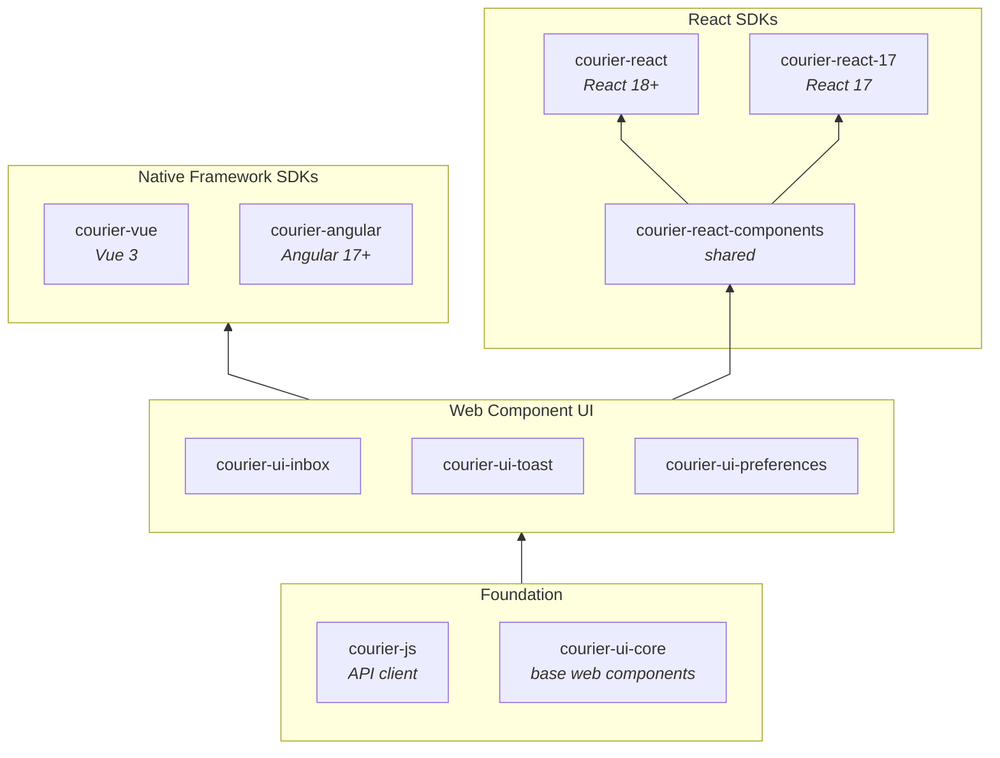

# `courier-web`

A monorepo that contains all packages for Courier's browser SDKs.

## Getting Started

### In VSCode IDEs

1. Open the `.vscode` folder, click `courier-web.code-workspace` then click the blue **"Open Workspace"** button in the bottom right


2. Click the **"Sync Packages"** button to install all dependencies


This will set up your development environment with all the necessary packages and configurations.

> You may need to click **"Sync Packages"** during development if some local packages get out of sync with each other.

### In the console

The Courier Web monorepo uses [Yarn workspaces](https://classic.yarnpkg.com/blog/2017/08/02/introducing-workspaces/) to manage dependencies.

1. Get setup with Node (using [nvm](https://github.com/nvm-sh/nvm?tab=readme-ov-file#installing-and-updating)) and [Yarn](https://classic.yarnpkg.com/lang/en/docs/install)

    ```sh
    nvm use
    ```

2. From the `courier-web` directory, install workspace dependencies. This will:

    - Install top-level dependencies
    - symlink each workspace into the top-level **node_modules**
    - Install workspaces' dependencies in their respective **node_modules**.

    ```sh
    yarn install
    ```

3. Build the packages

    ```sh
    yarn build-packages
    ```

## Packages

| Package | Description |
|---------|-------------|
| [`courier-js`](./@trycourier/courier-js) | The base API client and shared instance singleton for Courier's JavaScript Browser SDK |
| [`courier-ui-core`](./@trycourier/courier-ui-core) | Web components used in UI level packages |
| [`courier-ui-inbox`](./@trycourier/courier-ui-inbox) | Web components for Courier Inbox |
| [`courier-ui-toast`](./@trycourier/courier-ui-toast) | Web components for Courier Toast |
| [`courier-ui-preferences`](./@trycourier/courier-ui-preferences) | Web components for Courier Preferences |
| [`courier-react-components`](./@trycourier/courier-react-components/) | Shared package of React components for `courier-react` and `courier-react-17` |
| [`courier-react`](./@trycourier/courier-react) | React 18+ components for Courier Inbox |
| [`courier-react-17`](./@trycourier/courier-react-17/) | React 17 components for Courier Inbox |
| [`courier-vue`](./@trycourier/courier-vue) | Vue 3 components for Courier Inbox |
| [`courier-angular`](./@trycourier/courier-angular) | Angular 17+ components for Courier Inbox |

### Architecture



The `courier-js` API client and `courier-ui-core` web components form the foundation. The `courier-ui-*` packages build the framework-agnostic web component UI on top of them. Framework SDKs wrap those web components: the React SDKs share logic through `courier-react-components`, while `courier-vue` and `courier-angular` wrap the web components directly.

## API Extractor

Each package's public API is tracked in [**api**](./api/) via [API Extractor](https://api-extractor.com), and CI fails if the committed spec is out of date. If you change a public API, regenerate the spec in the same PR:

```sh
yarn generate-api-docs
```

## Versioning and releasing

Versions and changelogs are managed by [changesets](https://github.com/changesets/changesets). Add a changeset to your PR:

```sh
yarn changeset
```

Changesets maintains a "Version Packages" PR that bumps versions and updates changelogs. Merging it publishes the packages to npm automatically via [trusted publishing](https://docs.npmjs.com/trusted-publishers).
